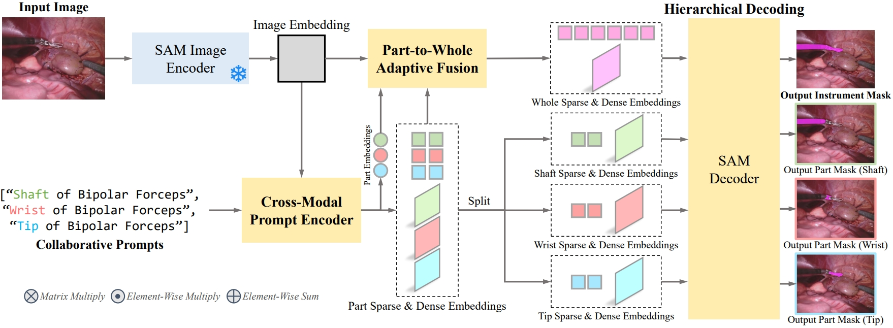
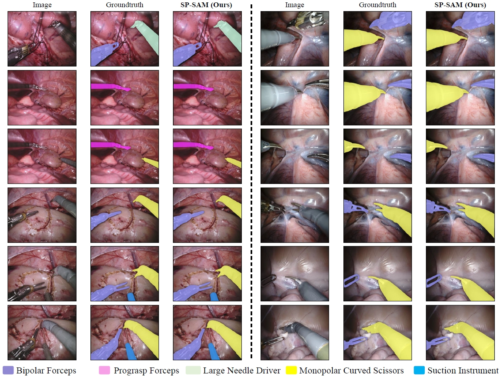
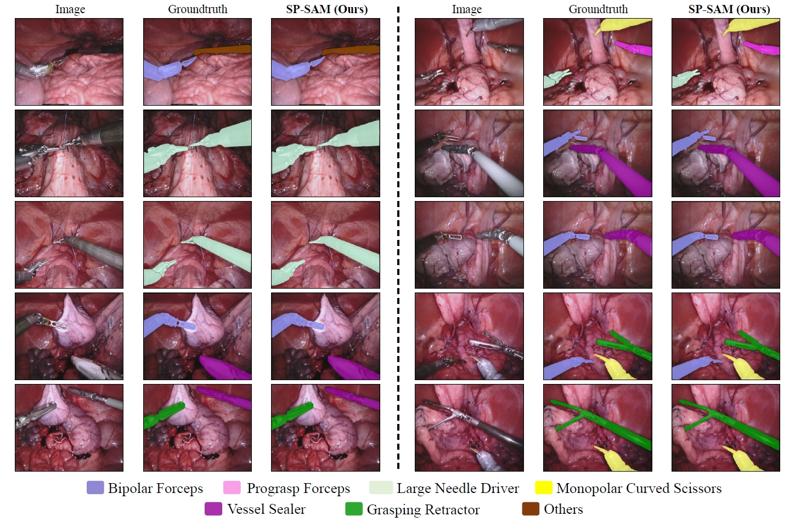

<h1 align="center"> SurgicalPart-SAM: Part-to-Whole Collaborative Prompting for Surgical Instrument Segmentation </h1>
<p align="center">
<a href="https://arxiv.org/pdf/2312.14481.pdf">"></a>
</p>
<h5 align="center"><em>Wenxi Yue, Jing Zhang, Kun Hu, Qiuxia Wu, Zongyuan Ge, Yong Xia, Jiebo Luo, Zhiyong Wang</em></h5>
</p>
<p align="center">
  <a href="#news">News</a> |
  <a href="#abstract">Abstract</a> |
  <a href="#results">Results</a> |
  <a href="#installation">Installation</a> |
  <a href="#data">Data</a> |
  <a href="#checkpoints">Checkpoints</a> |
  <a href="#train">Train</a> |
  <a href="#inference">Inference</a>
</p>


## News 

**2023.12.22** - The tech report is posted on arxiv. Work in progress.


## Abstract 
Foundation models like the Segment Anything Model (SAM) have demonstrated promise in generic object segmentation. However, directly applying SAM to surgical instrument segmentation presents key challenges. First, SAM relies on per-frame point-or-box prompts which complicate surgeon-computer interaction. Also, SAM yields suboptimal performance on segmenting surgical instruments, owing to insufficient surgical data in its pre-training as well as the complex structure and fine-grained details of various surgical instruments. To address these challenges, in this paper, we investigate text promptable surgical instrument segmentation and propose SP-SAM (SurgicalPart-SAM), a novel efficient-tuning approach that integrates surgical instrument structure knowledge with the generic segmentation knowledge of SAM. Specifically, we achieve this by proposing (1) collaborative prompts in the text form "[part name] of [instrument category name]" that decompose instruments into fine-grained parts; (2) a Cross-Modal Prompt Encoder that encodes text prompts jointly with visual embeddings into discriminative part-level representations; and (3) a Part-to-Whole Selective Fusion and a Hierarchical Decoding strategy that selectively assemble the part-level representations into a whole for accurate instrument segmentation. Built upon them, SP-SAM acquires a better capability to comprehend surgical instrument structures and distinguish between various categories. Extensive experiments on both the EndoVis2018 and EndoVis2017 datasets demonstrate SP-SAM's state-of-the-art performance with minimal tunable parameters.


<figcaption align = "center"><b>Figure 1: Overview of SurgicalPart-SAM. 
 </b></figcaption>


 ## Results

<p align="center">
  
</p>

<p align="center">
  
</p>
<figcaption align = "center"><b>Figure 2: Visualisation Results of SurgicalPart-SAM.
 </b></figcaption>


 ##  Citing SurgicalPart-SAM

If you find SurgicalPart-SAM helpful, please consider citing:
```
@misc{yue2023surgicalpartsam,
      title={Part to Whole: Collaborative Prompting for Surgical Instrument Segmentation}, 
      author={Wenxi Yue and Jing Zhang and Kun Hu and Qiuxia Wu and Zongyuan Ge and Yong Xia and Jiebo Luo and Zhiyong Wang},
      year={2023},
      eprint={2312.14481},
      archivePrefix={arXiv},
      primaryClass={cs.CV}
}
```
